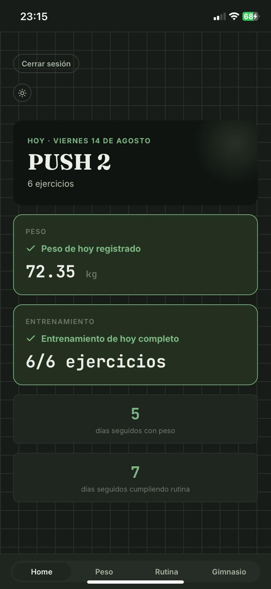
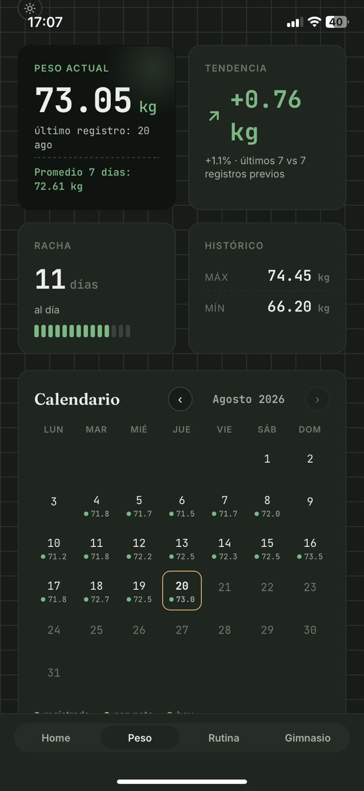
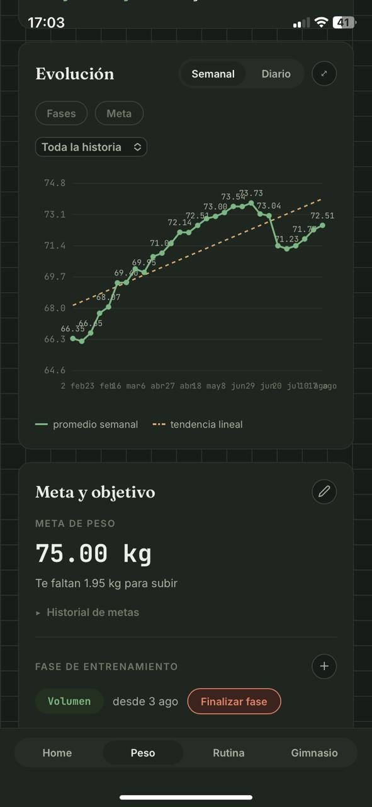
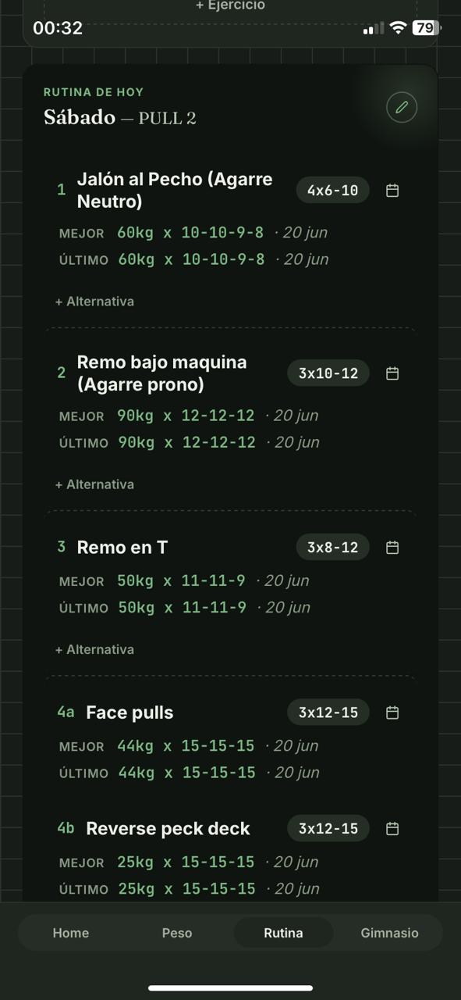

# FitTracker

A personal fitness tracker: daily body weight logging, gym routine management, and training analytics, built as a mobile-first installable PWA.

> This is a single-user personal project (no sign-up, one private account), so the live link isn't something you can click through and explore — these screenshots are here instead.

## Screenshots

<table>
<tr>
<td align="center"> Home</td>
<td align="center"> Weight dashboard & calendar</td>
</tr>
<tr>
<td align="center"> Evolution chart & goal</td>
<td align="center"> Gym routine</td>
</tr>
</table>

## What it does

- Daily weight log with calendar view, weekly averages, and an evolution chart (trend line, goal line, training-phase overlays)
- Weekly gym routine with exercises, sets/reps targets per day, and per-exercise history
- Training analytics: streaks, weekly volume per muscle group, monthly summary, and auto-detected personal records
- Installable PWA with offline-capable shell, light/dark theme

## Stack

Vanilla JS (ES modules, no framework, no build step) · Supabase (Postgres + Auth + Row Level Security) · Vercel
